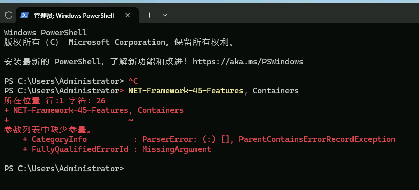

# 阿里云Next.js外贸网站部署文档 (Windows Server 2025)

## 服务器环境要求
- 操作系统：Windows Server 2025 数据中心版 64位中文版
- 内存：至少4GB RAM (您的配置：4 GiB)
- 存储：至少100GB SSD (您的配置：100 GiB ESSD AutoPL 云盘)
- CPU：至少2核 (您的配置：2 核)
- 网络：公网IP (您的配置：8.221.117.121)
- 带宽：至少10 Mbps (您的配置：100 Mbps)

## 部署前准备

### 1. 阿里云ECS实例信息
- 实例ID：您的实例
- 公网IP：8.221.117.121
- 私网IP：172.29.17.41
- 操作系统：Windows Server 2025 数据中心版 64位中文版
- 实例规格：ecs.e-c1m2.large (2核4GB)
- 系统盘：100 GiB ESSD AutoPL 云盘
- 公网带宽：100 Mbps (按使用流量计费)

### 2. 域名准备
- 注册域名：cn-pipes.com
- 完成ICP备案（如使用国内服务器）
- 配置DNS解析到服务器IP 8.221.117.121

### 3. 项目信息
- 项目类型：Next.js 14 应用
- 技术栈：React, TypeScript, Tailwind CSS
- 功能特性：多语言支持（13种语言）、响应式设计、产品展示
- GitHub仓库：https://github.com/globalcarselect/D-wenj-tj-jtpipe-

## 部署步骤

### 1. 服务器初始化 (Windows Server 2025)
```powershell
# 以管理员身份运行 PowerShell

# 检查系统信息
systeminfo

# 安装Windows更新 (方法1: 通过Windows Update PowerShell模块)
# 首先安装PSWindowsUpdate模块 (如果需要)
Install-Module -Name PSWindowsUpdate -Force -AllowClobber
Import-Module PSWindowsUpdate
Get-WindowsUpdate -AcceptAll -Install -AutoReboot

# 或方法2: 通过设置应用手动更新
# 1. 打开"设置" -> "更新和安全" -> "Windows 更新"
# 2. 点击"检查更新"
# 3. 安装所有可用更新并重启

# 安装必要的Windows功能
Install-WindowsFeature -Name Web-Server, 

# 重启服务器（如果需要）
Restart-Computer -Force

PS C:\Users\Administrator> Install-WindowsFeature -Name Web-Server

```

### 2. 安装开发环境和工具

#### 安装Node.js (使用NVM for Windows)
```powershell
# 方法一：使用Chocolatey安装Node.js
# 首先安装Chocolatey包管理器
Set-ExecutionPolicy Bypass -Scope Process -Force
[System.Net.ServicePointManager]::SecurityProtocol = [System.Net.ServicePointManager]::SecurityProtocol -bor 3072
iex ((New-Object System.Net.WebClient).DownloadString('https://chocolatey.org/install.ps1'))

# 安装Node.js LTS版本
choco install nodejs-lts -y

# 方法二：手动下载安装Node.js
# 访问 https://nodejs.org/ 下载Windows安装包
# 安装后验证版本
node --version
npm --version
```

#### 安装Git
```powershell
# 使用Chocolatey安装Git
choco install git -y

# 或下载Git for Windows安装包
# 访问 https://git-scm.com/download/win

# 配置Git用户信息
git config --global user.name "Your Name"
git config --global user.email "your.email@example.com"
```

#### 安装Docker Desktop for Windows (可选)
```powershell
# 下载Docker Desktop for Windows
# 访问 https://docs.docker.com/desktop/install/windows-install/
# 注意：需要启用Hyper-V或WSL 2后端
```

### 3. 部署Next.js应用程序

#### 从GitHub克隆项目
```powershell
# 创建项目目录
New-Item -ItemType Directory -Path "C:\Websites" -Force
cd C:\Websites

# 克隆仓库
git clone https://github.com/globalcarselect/D-wenj-tj-jtpipe-.git jtpipeline
cd jtpipeline

# 安装依赖
npm install
```

#### 配置环境变量
```powershell
# 创建环境变量文件
Copy-Item .env.example .env.production -ErrorAction SilentlyContinue

# 编辑环境变量文件（根据实际情况调整）
notepad .env.production
```

`.env.production` 文件内容示例：
```
NODE_ENV=production
NEXT_PUBLIC_SITE_URL=https://www.cn-pipes.com
NEXT_PUBLIC_API_BASE_URL=https://api.cn-pipes.com
# 多语言配置
NEXT_PUBLIC_DEFAULT_LOCALE=zh-CN
NEXT_PUBLIC_SUPPORTED_LOCALES=zh-CN,en-US,ja-JP,ko-KR,fr-FR,de-DE,es-ES,pt-BR,ru-RU,ar-SA,it-IT,nl-NL,tr-TR
```

#### 构建生产版本
```powershell
# 构建项目
# 重要：确保当前目录是项目目录 C:\Websites\jtpipeline
# 使用以下命令检查当前目录：pwd
# 如果需要切换目录：cd C:\Websites\jtpipeline
npm run build

# 构建成功后，可以测试运行
npm start
```

### 4. 配置Web服务器 (IIS + URL Rewrite + Application Request Routing)

#### 安装IIS和相关模块
```powershell
# 启用IIS功能
Install-WindowsFeature -Name Web-Server, Web-WebServer, Web-Common-Http, Web-Default-Doc, Web-Dir-Browsing, Web-Http-Errors, Web-Static-Content, Web-Health, Web-Http-Logging, Web-Performance, Web-Stat-Compression, Web-Security, Web-Filtering, Web-App-Dev, Web-Net-Ext45, Web-Asp-Net45, Web-ISAPI-Ext, Web-ISAPI-Filter, Web-Mgmt-Tools

# 安装URL Rewrite模块
# 方法1：通过Web Platform Installer (WebPI) - 推荐
# 下载并安装Web Platform Installer：https://www.microsoft.com/web/downloads/platform.aspx
# 通过WebPI搜索并安装"URL Rewrite 2.1"

# 方法2：手动下载安装
# 1. 下载URL Rewrite模块：
#    x64版本：https://download.microsoft.com/download/C/9/E/C9E8180D-4E51-40A6-A9BF-776990D8BCA9/rewrite_amd64.msi
#    x86版本：https://download.microsoft.com/download/C/9/E/C9E8180D-4E51-40A6-A9BF-776990D8BCA9/rewrite_x86.msi
# 2. 运行安装程序：
msiexec /i rewrite_amd64.msi /quiet /norestart

# 方法3：使用PowerShell下载并安装
$rewriteUrl = "https://download.microsoft.com/download/C/9/E/C9E8180D-4E51-40A6-A9BF-776990D8BCA9/rewrite_amd64.msi"
$rewriteInstaller = "C:\Temp\rewrite_amd64.msi"
New-Item -ItemType Directory -Path "C:\Temp" -Force -ErrorAction SilentlyContinue
Invoke-WebRequest -Uri $rewriteUrl -OutFile $rewriteInstaller
Start-Process msiexec -ArgumentList "/i `"$rewriteInstaller`" /quiet /norestart" -Wait

# 验证URL Rewrite模块安装
# 重启IIS服务
iisreset

# 检查URL Rewrite模块是否安装成功
Get-WebGlobalModule | Where-Object {$_.Name -eq "UrlRewriteModule"} | Format-Table Name, Image
```

#### 配置IIS反向代理到Next.js
1. 打开IIS管理器
2. 创建新网站：
   - 网站名称：jtpipeline
   - 物理路径：C:\Websites\jtpipeline
   - 绑定：端口80，主机名（可选）
3. 配置URL重写规则：
   - 添加反向代理规则，将所有请求代理到 `http://localhost:3000`

或使用web.config文件：
```xml
<?xml version="1.0" encoding="UTF-8"?>
<configuration>
  <system.webServer>
    <rewrite>
      <rules>
        <rule name="ReverseProxyInboundRule1" stopProcessing="true">
          <match url="(.*)" />
          <action type="Rewrite" url="http://localhost:3000/{R:1}" />
        </rule>
      </rules>
    </rewrite>
  </system.webServer>
</configuration>
```

### 5. 配置Windows服务 (使用PM2)

#### 安装PM2
```powershell
npm install -g pm2

# 创建PM2 Windows服务
npm install -g pm2-windows-startup

# 启动Next.js应用
pm2 start npm --name "jtpipeline-website" -- start

# 保存PM2配置
pm2 save

# 设置PM2开机自启
pm2-startup install
```

### 6. SSL证书配置 (使用阿里云SSL证书)

#### 申请免费SSL证书
1. 登录阿里云控制台
2. 进入SSL证书服务
3. 申请免费DV SSL证书
4. 完成域名验证

#### 安装SSL证书到IIS
1. 下载证书文件（.pfx格式）
2. 在IIS管理器中导入证书：
   - 打开服务器证书
   - 点击"导入"
   - 选择.pfx文件，输入密码
3. 为网站绑定HTTPS：
   - 编辑网站绑定
   - 添加HTTPS绑定，选择导入的证书

### 7. 多语言配置

#### 验证多语言功能
项目已内置13种语言支持：
- 中文简体 (zh-CN)
- 英语 (en-US)
- 日语 (ja-JP)
- 韩语 (ko-KR)
- 法语 (fr-FR)
- 德语 (de-DE)
- 西班牙语 (es-ES)
- 葡萄牙语 (pt-BR)
- 俄语 (ru-RU)
- 阿拉伯语 (ar-SA)
- 意大利语 (it-IT)
- 荷兰语 (nl-NL)
- 土耳其语 (tr-TR)

语言切换功能已集成到网站头部，部署后即可使用。

### 8. 性能优化

#### 启用静态文件缓存
```xml
<!-- 在web.config中添加缓存规则 -->
<configuration>
  <system.webServer>
    <staticContent>
      <clientCache cacheControlMode="UseMaxAge" cacheControlMaxAge="365.00:00:00" />
    </staticContent>
  </system.webServer>
</configuration>
```

#### 配置阿里云CDN
1. 登录阿里云控制台，开通CDN服务
2. 添加加速域名：www.cn-pipes.com
3. 配置源站信息：8.221.117.121
4. 配置缓存策略：
   - 静态文件（图片、CSS、JS）：缓存30天
   - HTML文件：缓存1小时

### 9. 安全配置

#### 配置Windows防火墙
```powershell
# 开放HTTP和HTTPS端口
New-NetFirewallRule -DisplayName "HTTP-In" -Direction Inbound -Protocol TCP -LocalPort 80 -Action Allow
New-NetFirewallRule -DisplayName "HTTPS-In" -Direction Inbound -Protocol TCP -LocalPort 443 -Action Allow

# 限制管理端口（如远程桌面）
New-NetFirewallRule -DisplayName "RDP-In" -Direction Inbound -Protocol TCP -LocalPort 3389 -RemoteAddress "您的IP地址" -Action Allow
```

#### 阿里云安全组配置
1. 登录阿里云ECS控制台
2. 进入安全组配置
3. 添加入站规则：
   - 协议：TCP，端口：80，源：0.0.0.0/0
   - 协议：TCP，端口：443，源：0.0.0.0/0
   - 协议：TCP，端口：3000，源：0.0.0.0/0（或限制为本地）

### 10. 备份策略

#### 项目文件备份
```powershell
# 创建备份脚本 backup.ps1
$backupDir = "C:\Backups\jtpipeline"
$sourceDir = "C:\Websites\jtpipeline"
$date = Get-Date -Format "yyyyMMdd_HHmmss"

New-Item -ItemType Directory -Path $backupDir -Force
Compress-Archive -Path $sourceDir -DestinationPath "$backupDir\backup_$date.zip" -Force

# 删除7天前的备份
Get-ChildItem -Path $backupDir -Filter "backup_*.zip" | Where-Object {$_.CreationTime -lt (Get-Date).AddDays(-7)} | Remove-Item
```

#### 设置定时备份任务
```powershell
# 创建计划任务
$action = New-ScheduledTaskAction -Execute "PowerShell.exe" -Argument "-File C:\Scripts\backup.ps1"
$trigger = New-ScheduledTaskTrigger -Daily -At 2:00AM
Register-ScheduledTask -TaskName "jtpipeline_backup" -Action $action -Trigger $trigger -Description "每日备份jtpipeline网站"
```

### 11. 监控和维护

#### 使用Windows性能监视器
1. 打开"性能监视器"
2. 添加计数器：
   - CPU使用率
   - 内存使用量
   - 网络流量
   - 磁盘I/O

#### 配置阿里云云监控
1. 登录阿里云云监控控制台
2. 为ECS实例安装监控插件
3. 设置报警规则：
   - CPU使用率 > 80%
   - 内存使用率 > 85%
   - 磁盘使用率 > 90%

### 12. 故障排除

#### 常见问题
1. **Next.js应用无法启动**：
   ```powershell
   # 检查端口占用
   netstat -ano | findstr :3000
   
   # 检查Node.js进程
   Get-Process node
   
   # 查看PM2日志
   pm2 logs jtpipeline-website
   ```

2. **IIS反向代理不工作**：
   - 确认URL Rewrite模块已安装
   - 检查web.config配置
   - 查看IIS日志：C:\inetpub\logs\LogFiles

3. **多语言切换无效**：
   - 确认浏览器语言设置
   - 检查本地化文件是否存在
   - 验证语言上下文是否正确加载

#### 调试命令
```powershell
# 检查服务状态
Get-Service W3SVC  # IIS服务
pm2 status          # PM2进程状态

# 查看日志
Get-EventLog -LogName Application -Newest 20 | Where-Object {$_.Source -like "*Node*" -or $_.Source -like "*IIS*"}
pm2 logs jtpipeline-website --lines 100
```

### 13. 自动部署脚本

创建自动化部署脚本 `deploy.ps1`：
```powershell
# deploy.ps1
Write-Host "开始部署 jtpipeline 网站..." -ForegroundColor Green

# 停止现有服务
pm2 stop jtpipeline-website
pm2 delete jtpipeline-website

# 拉取最新代码
cd C:\Websites\jtpipeline
git pull origin main

# 安装依赖
npm install

# 构建项目
npm run build

# 启动服务
pm2 start npm --name "jtpipeline-website" -- start
pm2 save

Write-Host "部署完成！" -ForegroundColor Green
```

## 完成部署
完成以上步骤后，访问您的域名 https://www.cn-pipes.com 即可看到网站正常运行。多语言切换功能位于网站右上角。